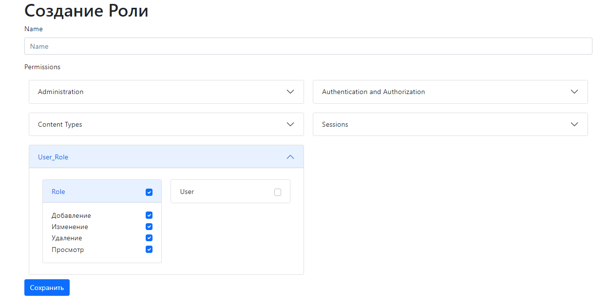
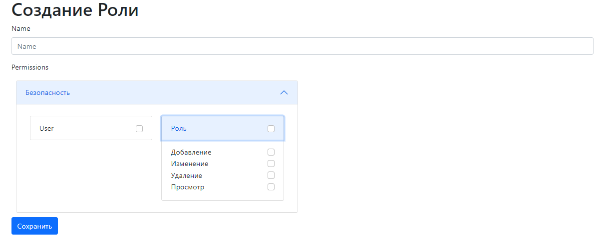

<a href="https://pypi.org/project/django-role/">
  
</a>
<a href="https://pypi.org/project/django-role/">
  
</a>
<a href="https://github.com/isys35/django-role">
  
</a>

# django-role

Пакет включает в себя:
* Модель пользователя с **ролью** вместо **групп**
* Виджет для выбора прав

Роль в отличии от групп связана с моделю пользователя связью **Один ко многим**

## Установка

```pip install django-role```

```poetry add django-role```

### Использование модели пользователя

_settings.py_
```python
AUTH_USER_MODEL = "user_role.User"
```

### Использование виджета для выбора прав

_settings.py_
```python
PERMISSIONS_LABELS = {
    "add": "Добавление",
    "change": "Изменение",
    "view": "Просмотр",
    "delete": "Удаление",
}
```

_forms.py_
```python
from django import forms
from django.contrib.auth.models import Permission
from django.utils.translation import gettext_lazy as _

from user_role.models import Role
from user_role.widgets import PermissionsSelectMultiply


class RoleCreationForm(forms.ModelForm):
    permissions = forms.ModelMultipleChoiceField(
        label=_("Permissions"),
        widget=PermissionsSelectMultiply(),
        queryset=Permission.objects.all()
    )

    class Meta:
        model = Role
        fields = [
            "name",
            "permissions"
        ]
```



### Группирование прав и настройка виджета

```python
class MyPermissionsSelectMultiply(PermissionsSelectMultiply):
    groups_permissions = {
        "Безопасность": ["user_role.user", "user_role.role"]
    }
```

